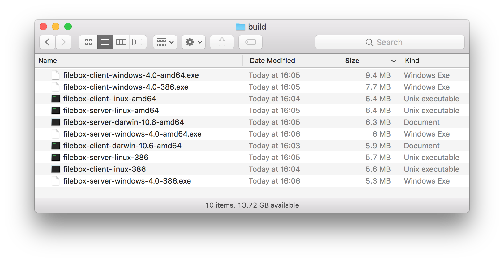

Filebox allows remote users to work on the same directory in real-time. It's written in Go.

Filebox is my project for the [Networking Workshop](https://www.openu.ac.il/courses/20588.htm) in the Open University of Israel.

## Features

* Support for multiple users in a client-server architecture
* Real-time - when a user edits a file, the changes are immediatley reflected to other users 
* The shared directory functions just like a regular directory (this is achieved through [FUSE](https://en.wikipedia.org/wiki/Filesystem_in_Userspace))
* All files are saved in the server's disk
* Cross platform (Windows, Linux, macOS)

## Usage

TODO: Install winfsp/osxfuse

First, download the client and server binaries for your operating system from the [GitHub's releases section](https://github.com/alongubkin/filebox/releases).

The following command will open a Filebox server in TCP port 8763. Note that you can choose the directory you want to share via the --path argument:

    filebox-server --port 8763 --path <path-to-your-shared-directory>

To run a Filebox client, simply run the following command from any number of client machines:

    filebox-client --address <server-ip>:8763 --mountpoint <path-to-mountpoint>

Navigate to the mountpoint directory, and you can now easily share files using the operating system's normal interface :)

## Building and Testing

### Requirements

The only requirement for building the project is [Docker](https://www.docker.com/), which can be installed on any platform (Windows, Linux, macOS) and provides container technology.

You can use [this link](http://downloaddocker.com/) in order to run Docker without login.

To run tests, you also need [Python 3](https://www.python.org/) and the pytest package installed:

    pip3 install pytest
 
### Compilation

The entire build process, including downloading the dependencies, happens in a Docker container. This build process is defined in the [Dockerfile](Dockerfile).

Additionally, this Docker container cross-compiles Filebox for all supported operating systems. It also automatically run the tests on the Linux container itself.

Simply run the following command:

    cd <path-to-filebox>
    docker build -t filebox . \
      && docker rm filebox-build \
      && docker run --name filebox-build --device /dev/fuse --cap-add SYS_ADMIN -it filebox \
      && docker cp filebox-build:/build .

And all the binaries should be in the build directory, which looks like:

### Running Tests

Make sure you have the Filebox binaries in the build directory of the project (near pkg, test, etc). If you compiled using the instructions above, you should be ready.

To run tests, navigate to the test directory and simply run `pytest`.

### Tests Specification

Single test that consists of a Filebox server and 5 clients, all running on the same machine (for simplicity purposes) in different directories.

This test should cover all supported filesystem operations except Truncate. It does the following:

  - Create a directory and write a file to it in some shared directory X.
  - Make sure the directory and the file appear correctly in all other shared directories.
  - Rename the new file in X.
  - Make sure all other shared directories contain the renamed file, and not the original file.
  - Delete the file and the directory in X.
  - Make sure all other shared directories don't have the deleted directory.

X is each one of the 5 shared directories.

## Design

In this section, I will explain some of the design decisions I made in the project.

### FUSE

FUSE (Filesystem in Userspace) is an API that allows user-mode programs to create virtual directories. 

When the operating system or a third-party program want to execute an operation in the virtual directory (e.g create file, delete directory, list files), the user-mode program that created the virtual directory (using FUSE) gets a callback that can handle the operation in any way it wants. In this way, it's possible to create filesystems that aren't backed by the disk (e.g: memory file systems). 

We will use FUSE in order to build a **networked** file system. When Filebox receives a callback such as "Create MyFile.txt", it communicates with the server and sends a request to create MyFile.txt. It then waits for the server's response, and notifies FUSE whether the operation succeeded or not.

I chose to write Filebox in Go because of the *cross platform requirement*. Currently, the only FUSE library that supports all major operating systems (Windows, Linux, macOS) is [cgofuse](https://github.com/billziss-gh/cgofuse), and it's written in Go. 

**Filebox supports the following operations:**

* Create, open, read, write, rename, truncate and delete files
* Create, delete and list directories

To simplify the solution, Filebox doesn't support symlinks or permissions (chmod / chown). 

### Network Protocol

Before designing Filebox's network protocol, I chose to take a look at some other protocols that are used for providing shared access to files over the network. 

The most prominent one was [Server Message Block (SMB)](https://wiki.wireshark.org/SMB2), which a TCP-based protocol that is used when you access a network path in Windows such as: `\\MomPC\Share`. An important feature of SMB is that it allows to send multiple requests before getting any response. Matching responses to requests is done by giving each command a sequence number, or ID.

This feature is important for performance because FUSE allows to execute multiple operations in parallel on the virtual directory.  

In order to support dynamically-sized structs (e.g structs that contain strings), I use Go's official [gob](https://golang.org/pkg/encoding/gob/) serialization library.

### Modules

TODO: concurrency, go channels, atomic

## Network Protocol Specification

The Filebox protocol is based on TCP. It is a request-response protocol like HTTP, but multiple requests can be sent before receiving a response. This is necessary for the filesystem performance.

The protocol is defined in [pkg/protocol/messages.go](pkg/protocol/messages.go).

### Message Structure

All messages in Filebox's protocol look like:

    type Message struct {
        MessageID  uint32
        IsResponse bool
        Data       interface{}
        Success    bool
    }

Messages from client to server are request messages (e.g, `CreateFileRequest`), so the `IsResponse` flag should be set to false. In contrast, messages from server to client are response messages (e.g, `CreateFileResponse`), so the `IsResponse` flag should be set to true.

`MessageID` is used to synchronize between messages, since multiple requests can be sent before a response is received. It is an incremented integer, and should be identical in both the matching request and response messages.

`Data` contains a specific request / response message struct, depending on the message type. For example: `CreateFileRequest`, `ReadFileResponse`, etc. The gob library supports deserializing dynamic types such as `interface{}` (which is like `void*` in C).

### Example command: ReadFile

The ReadFile command consists of the following request parameters:

    type ReadFileRequest struct {
        FileHandle uint64
        Offset     int64
        Size       int
    }

`FileHandle` is a virtual number which represents a file that was opened by an `OpenFile` command. `Offset` and `Size` specify where and how many bytes we wants to read from the file.

The response looks like:

    type ReadFileResponse struct {
        Data      []byte
        BytesRead int
    }

### File info

Various commands return information about one or more files, e.g: `GetFileAttributes`, `ReadDirectory`. Therefore, I use a generic `FileInfo` struct which looks like:

    type FileInfo struct {
        Name    string      // base name of the file
        Size    int64       // length in bytes for regular files; system-dependent for others
        Mode    os.FileMode // file mode bits
        ModTime time.Time   // modification time
        IsDir   bool        // abbreviation for Mode().IsDir()
    }

